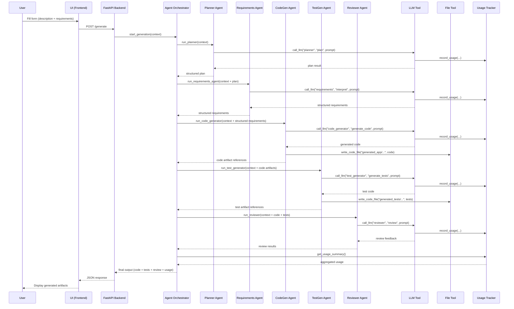

# MCP Flow – Multi-Agent Expense Comparator

This document describes how the system conceptually uses the **Model Context Protocol (MCP)**: how agents call tools, how LLM usage is tracked, and how a single `/generate` request flows through the system.

---

## 1. MCP Concept in This Project

In this project, we treat each **capability** (e.g., writing files, tracking usage, calling the LLM) as an MCP-style **tool** that agents can call.

Core ideas:

- Agents do **not** directly handle:
  - File system operations
  - LLM configuration
  - Usage logging
- Instead, they call tools exposed by the MCP layer in `src/mcp/`.

This keeps agents:
- Focused on reasoning + generation.
- Easier to test and reuse.

---

## 2. MCP Tools Overview

We conceptually expose three main MCP tools:

1. **LLM Tool** – wraps the OpenAI SDK.
2. **File Tool** – writes generated code/tests to disk.
3. **Usage Tracker Tool** – records LLM usage per agent and per run.

These live in `src/mcp/` as Python modules but are treated as tools in the architecture.

---

## 3. LLM Tool

**Module (planned):** `src/mcp/llm_client.py`

### Responsibilities

- Provide a single entry point for all LLM calls.
- Apply consistent configuration:
  - Model name
  - Temperature
  - Max tokens
- Return:
  - Parsed model output
  - Usage metrics (prompt + completion tokens)

### Example (conceptual) interface

```python
def call_llm(agent_name: str, operation: str, prompt: str, **kwargs) -> dict:
    """
    Calls the underlying LLM and returns:
    {
      "content": "...",
      "usage": {
        "prompt_tokens": ...,
        "completion_tokens": ...,
        "total_tokens": ...
      }
    }
    """
```
Every agent calls call_llm(...) instead of the OpenAI SDK directly.

## 4. File Tool

**Module (planned):** `src/mcp/file_tool.py`

### Responsibilities

- Abstract file writing and reading for agents.
- Maintain a consistent generated project layout:
  - `generated_app/` — generated application code  
  - `generated_tests/` — generated pytest tests  

### Example (conceptual) interface

```python
def write_code_file(path: str, content: str) -> None:
    """Write generated code to the given path."""

def read_code_file(path: str) -> str:
    """Read a code file if an agent needs to inspect it."""
```

## 5. Usage Tracker Tool

**Module (planned):** `src/mcp/usage_tracker.py`

### Responsibilities

- Track LLM usage across all agents.
- Store:
  - Number of API calls
  - Input (prompt) tokens
  - Output (completion) tokens
  - Total token usage
  - Which agent performed which operation
- Provide aggregated metrics for:
  - The orchestrator
  - The `/usage` endpoint
  - The end-of-demo usage report

### Example conceptual API

```python
def record_usage(agent_name: str, operation: str, usage: dict) -> None:
    """
    Stores usage metrics like:
      - prompt_tokens
      - completion_tokens
      - total_tokens
    """

def get_usage_summary() -> dict:
    """
    Returns aggregated usage:
    {
      "total_calls": 10,
      "total_tokens": 12983,
      "by_agent": {
         "planner": {
             "calls": 2,
             "prompt_tokens": 400,
             "completion_tokens": 350,
             "total_tokens": 750
         },
         "code_generator": {...}
      }
    }
    """
```

How It Integrates With Other Tools

- The LLM Tool calls record_usage() after every model invocation.
- The Orchestrator asks the tracker for final usage metrics at the end of a run.
- The /usage API endpoint exposes the aggregated results to the user interface.

Benefits
- Centralized usage accounting
- Consistent per-agent tracking
- Easy reporting for the TA demo
- Debug visibility (spot which agent is “expensive”)

## 6. End-to-End MCP Flow for `/generate`

This describes the complete lifecycle of a generation request from the moment the user submits the form until the final artifacts and usage statistics are returned.



## 7. MCP Flow for `/usage`

The `/usage` endpoint exposes recorded LLM usage metrics accumulated during the multi-agent workflow.

### Flow Steps

1. The UI sends:  
   **`GET /usage`**

2. FastAPI forwards the request to the Usage Tracker tool:  
   **`usage_tracker.get_usage_summary()`**

3. The Usage Tracker returns:
   - Total number of LLM calls
   - Total tokens used
   - Prompt vs. completion tokens
   - Optional per-agent breakdown, e.g.:
     - planner
     - requirements_interpreter
     - code_generator
     - test_generator
     - reviewer

4. FastAPI returns the summary as JSON to the UI.

5. The UI displays usage metrics for:
   - Demo visualization
   - TA review
   - Debugging agent behavior

This endpoint confirms that the system meets the **“LLM Usage Tracking”** requirement from SWE270P.

---

## 8. Error Handling in MCP Flow

The system handles errors at multiple levels to ensure robustness and transparency.

---

### 8.1 LLM Errors

These are handled inside the **LLM Tool**:

Common failures:
- Invalid JSON from the model  
- OpenAI API rate limits  
- Timeout or network errors  
- Model refusing content (rare but possible)

Actions:
- Log error with:
  - agent name  
  - operation  
  - prompt that caused the failure (if permissible)  
- Return a structured error to the orchestrator  
- Orchestrator sends a clean error back to the FastAPI layer  

This prevents crashes and makes failures diagnosable.

---

### 8.2 File Tool Errors

Handled inside the **File Tool**:

Possible problems:
- Invalid file path  
- Permission denied  
- Unexpected characters in path  
- Missing folders  

Actions:
- Raise descriptive Python exception  
- Orchestrator catches and returns user-friendly error  
- Logging aids debugging

---

### 8.3 Orchestrator-Level Errors

Examples:
- Agents return malformed data  
- Required fields missing (e.g., no tasks in plan)  
- Test generator fails to create tests  
- Reviewer agent runs into LLM failure  

Actions:
- Orchestrator wraps the error in a structured payload  
- Logs:
  - which agent failed  
  - at which stage  
  - with what input  
- UI displays a clear error message instead of crashing

---

### 8.4 User Input Errors

Handled automatically by **FastAPI + Pydantic**.

Examples:
- Missing required fields in request body  
- Description or requirements are empty  
- Wrong data types (e.g., numbers instead of strings)  

FastAPI returns:
- HTTP **400 Bad Request**
- JSON validation error with exact cause

---

## 9. Implementation Status

In the first phase of the project:

### ✔️ MCP tools are Python modules  
Although not implementing a full MCP server/client, the architecture is MCP-inspired:
- Tools are treated as capabilities  
- Agents call them indirectly  
- Clean separation between “reasoning” and “doing”  

### ✔️ Agents do not touch raw I/O  
- All file writes go through the File Tool  
- All model calls go through the LLM Tool  
- All usage goes through the Tracker  

### ✔️ This satisfies project requirements  
Even without full MCP protocol implementation, the structure demonstrates:
- Multi-agent coordination  
- Tool invocation  
- Usage tracking  
- Clean boundaries  

---

## 10. Future Enhancements (Optional)

These may be added after the MVP to strengthen the project for the final presentation.

### Potential Upgrades

- **Full MCP Server Implementation**  
  Actual MCP servers instead of conceptual tools.

- **More Tools**
  - Template library tool  
  - Auto-schema validator  
  - Diagram generator tool  

- **Agent Extensions**
  - UI Generator Agent  
  - Visualization Agent (Plotly/Matplotlib generator)  
  - Refactoring Agent  

- **Target Multiple Languages**
  Allow users to generate:
  - Python
  - JavaScript
  - Java (optional)

- **Partial Regeneration**
  Let the user regenerate only tests or only certain modules.

- **Persistent Storage**
  Store past runs for comparison or debugging.

---

